## This is my collection of ideas:

**_CAUTION_**:: <b style="color: red;">**THIS IS ONLY CSS**</b>

- [animated-button-hover-effect](https://github.com/TanvirAlam/my-css/tree/main/animated-button-hover-effect) 
  
  
- [animated-radar-loader-effect](https://github.com/TanvirAlam/my-css/tree/main/animated-radar-loader-effect) 
  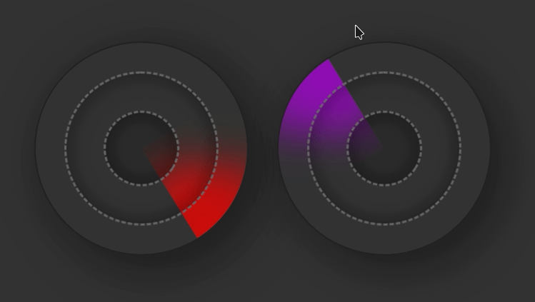

- [login-form-design](https://github.com/TanvirAlam/my-css/tree/main/login-form-design) 
  

- [action-menu-effect](https://github.com/TanvirAlam/my-css/tree/main/action-menu-effect) 
  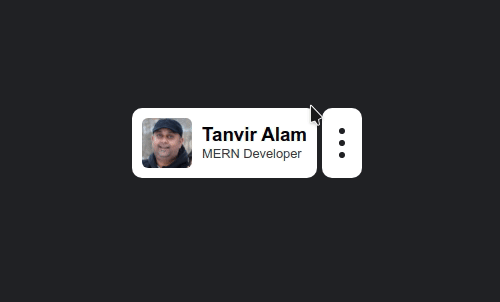

- [custom-checkbox-effect](https://github.com/TanvirAlam/my-css/tree/main/custom-checkbox-effect) 
  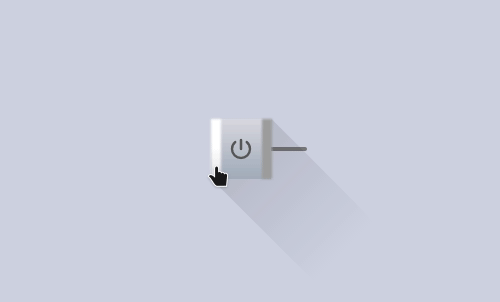

  - https://www.omnicalculator.com/math/square-diagonal
  - https://ionic.io/ionicons

- [glassmorphism-list-hover-effect](https://github.com/TanvirAlam/my-css/tree/main/glassmorphism-list-hover-effect) 
  

- [fancy-checkbox-effect](https://github.com/TanvirAlam/my-css/tree/main/fancy-checkbox-effect) 
  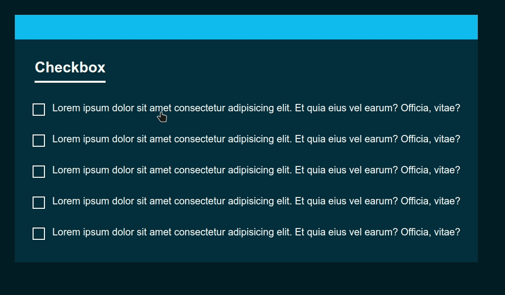

- [Animated 3d text effect](https://github.com/TanvirAlam/my-css/tree/main/animated-3d-text-effect) 
  

- [Animated search box effect](https://github.com/TanvirAlam/my-css/tree/main/animated-search-box-effect) 
  

  - `https://ionic.io/ionicons`

- [Animated box effect](https://github.com/TanvirAlam/my-css/tree/main/animated-box-effect) 
  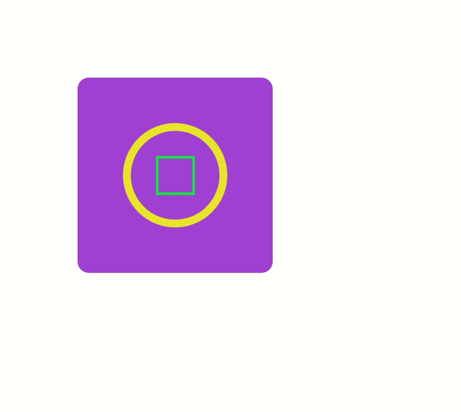

  - The inner HTML animation does not work

- [Animated SVG go creazy effect](https://github.com/TanvirAlam/my-css/tree/main/animated-svg-creazy-effect) 
  

- [Animated SVG effect](https://github.com/TanvirAlam/my-css/tree/main/animated-svg-effect) 
  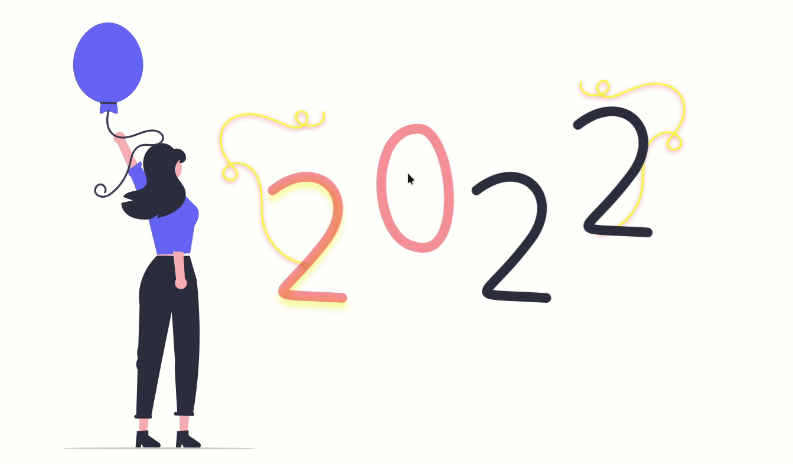

  - `https://undraw.co/illustrations`

- [Animated circle with fake shadow effect](https://github.com/TanvirAlam/my-css/tree/main/animated-circle-fake-shadow-effects) 
  

- [Particles Effect on Mousemove](https://github.com/TanvirAlam/my-css/tree/main/animated-particle-effect) 
  

  - `https://vincentgarreau.com/particles.js/`

- [The House](https://github.com/TanvirAlam/my-css/tree/main/animated-the-house) 
  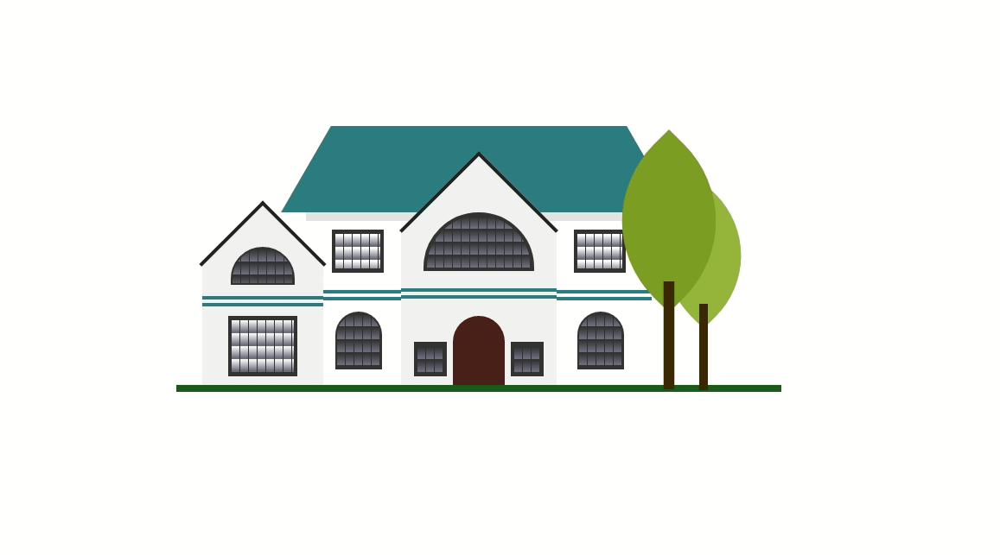

- [Water drops effect](https://github.com/TanvirAlam/my-css/tree/main/animated-water-drops-effects) 
  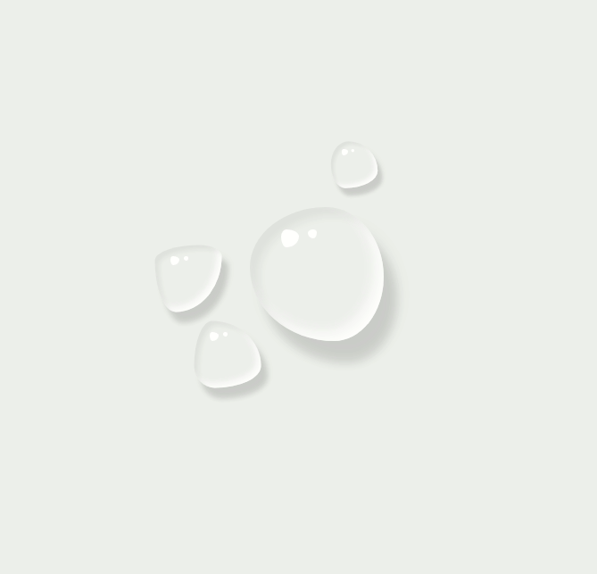

  - `https://9elements.github.io/fancy-border-radius/`

- [Animated abstract background effect](https://github.com/TanvirAlam/my-css/tree/main/animated-abstract-background-effect) 
  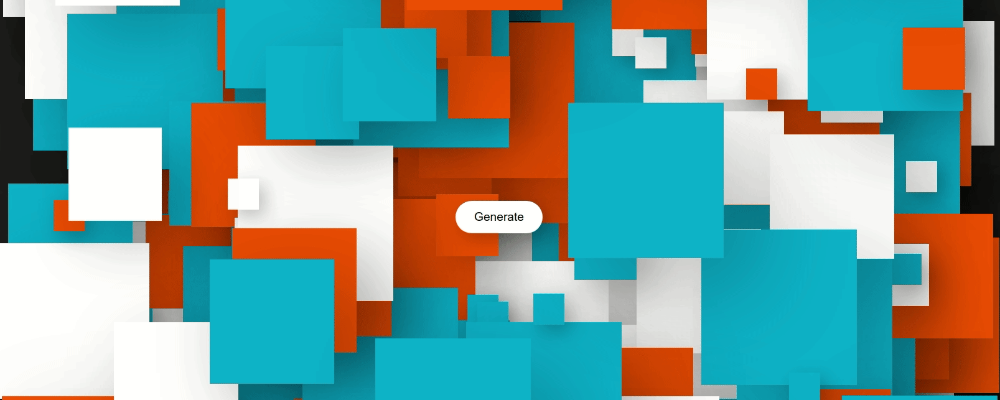

  - `https://animejs.com/`

- [Animated scratch off reveal content effect](https://github.com/TanvirAlam/my-css/tree/main/animated-scratch-off-reveal-content-effects) 
  

  - `https://p5js.org/`

- [Animated text distortion effect](https://github.com/TanvirAlam/my-css/tree/main/animated-text-distortion-effects) 
  

- [Animated fontawesome icon effect](https://github.com/TanvirAlam/my-css/tree/main/animated-fontawesome-icon-effect) 
  

- [Animated color loader effect](https://github.com/TanvirAlam/my-css/tree/main/animated-loading-effect) 
  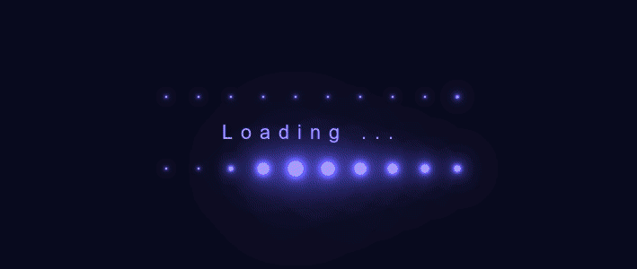

- [Anime JS Background Animation Effects](https://github.com/TanvirAlam/my-css/tree/main/animated-background-effect) 
  

  - `https://animejs.com/`

- [Glassmorphism Product Card effect](https://github.com/TanvirAlam/my-css/tree/main/animated-glassmorphism-card) 
  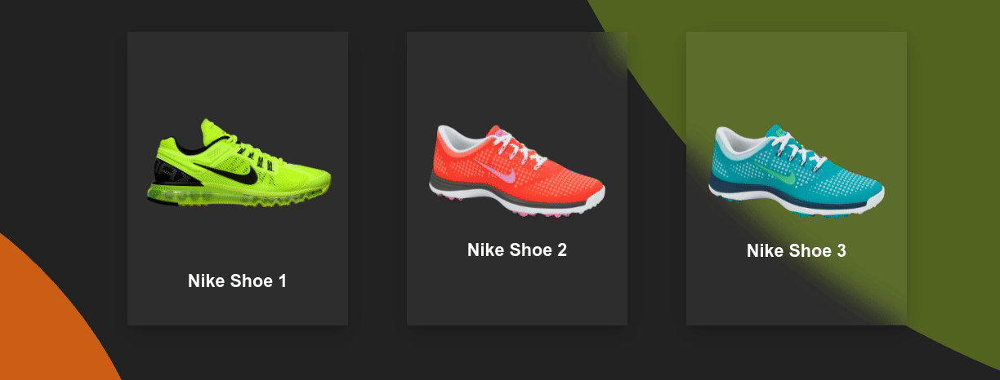

- [3D text effect](https://github.com/TanvirAlam/my-css/tree/main/animated-3d-text) 
  

- [Animated Loading climb effect](https://github.com/TanvirAlam/my-css/tree/main/animated-climb-effect) 
  

- [Frost Glass effect](https://github.com/TanvirAlam/my-css/tree/main/animated-frosted-glass-effect) 
  

- [Animated Working Analog Clock](https://github.com/TanvirAlam/my-css/tree/main/animated-analog-clock) 
  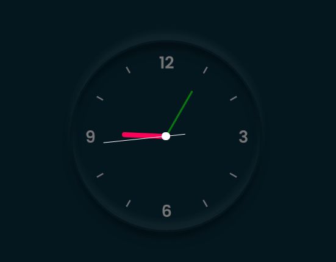

- [Animated Matrix effect](https://github.com/TanvirAlam/my-css/tree/main/animated-matrix-effect) 
  

- [Animated Neumorphism slider effect](https://github.com/TanvirAlam/my-css/tree/main/animated-neumorphism-slider-effect) 
  

- [animated smoke text reveal effect](https://github.com/TanvirAlam/my-css/tree/main/animated-smoke-text-effect) 

  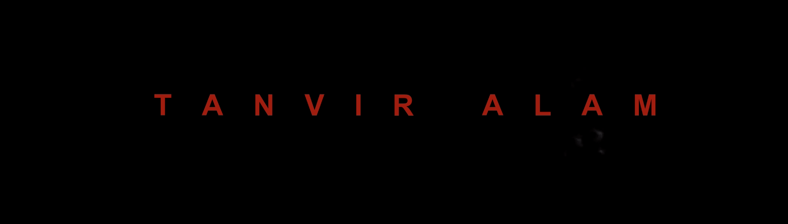

- [animated image hover effect](https://github.com/TanvirAlam/my-css/tree/main/animated-image-hover-effect) 

  

- [animated border](https://github.com/TanvirAlam/my-css/tree/main/animated-border-effect) 

  

- [animated navigation menu](https://github.com/TanvirAlam/my-css/tree/main/animated-navigation-menu) 

  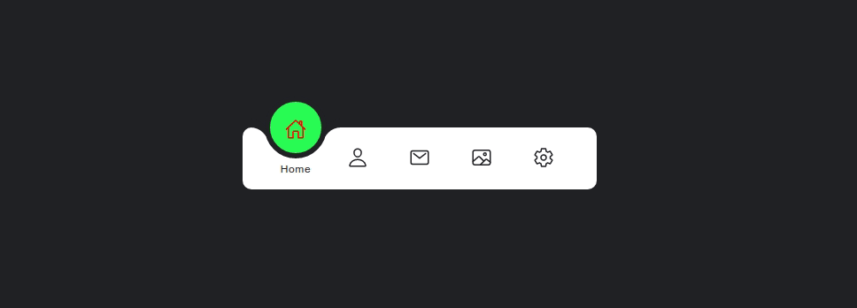

- [animated text effect](https://github.com/TanvirAlam/my-css/tree/main/animated-text-effect) 

  

- [animated card hover effect](https://github.com/TanvirAlam/my-css/tree/main/animated-card-hover-effect) 

  

- [animated neon light button hover](https://github.com/TanvirAlam/my-css/tree/main/animated-neon-light-button) 

  

- [Animated Earth and Mars](https://github.com/TanvirAlam/my-css/tree/main/animated-earth-mars) 
  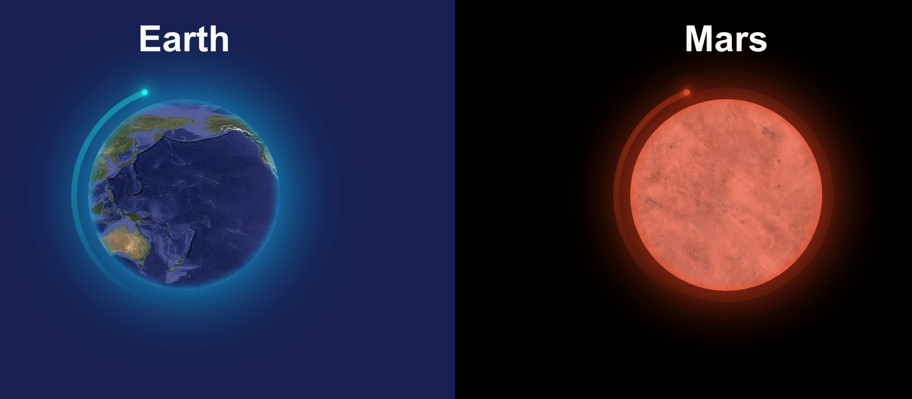

- [Animated Circle Text Logo Effects](https://github.com/TanvirAlam/my-css/tree/main/animated-circle-text) 
  

- [Custom animated spinner](https://github.com/TanvirAlam/my-css/tree/main/animated-spinner) 
  

- [Custom Checkbox with happy face](https://github.com/TanvirAlam/my-css/tree/main/animated-checkbox) 
  

- [Footer animated wave](https://github.com/TanvirAlam/my-css/tree/main/animated-footer-wave) 
  

- [Animated menu](https://github.com/TanvirAlam/my-css/tree/main/animated-menu) 
  

- [Glowing text](https://github.com/TanvirAlam/my-css/tree/main/animated-glowing-text) 
  
